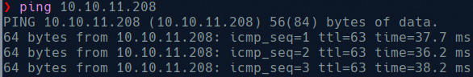

# Busqueda

We start by checking the connection with the machine:

Now we try to scan all open ports using nmap:

And now we are going to focus on ports 22 and 80 and try to get a little bit more on information:

In this image we can se the domain used by the web page, so now we will add this to the /etc/hosts

Once this is done, and we try to access to the web page where we see:

At the end of the site we can see that is powered by:

Now we look for a exploit for Searchor, we can see that we can execute commands. What we can do is create a payload that open a rever shell to our machine, the payload may look like this:

Now we can host an http server to make the payload available and make the server execute it, so now we need to listen on the 4777 port and using burpsuite send this post message to the web page

After send this post message we will get a rev shell:

And now we can get the user flag.

Now we will try to get root privileges. I tried different things, and at the end i found a .git directory 

In this rep we find a config with user and password, that we can reuse to see if we have root privileges. 

Now with this creds we will try to get the files that allow us to execute as root.

We see that exists a file [system-checkedup.py](http://system-checkedup.py) that is executed as root. We can’t see the content from svc so we will try to get help

In the /opt/scripts directory we can find some scripts that seem to be called by system-checkup.py, so what we can do is try to write our script and check if it is executed:

And executing it, we get: 

