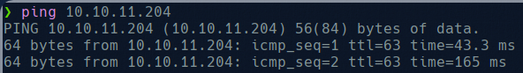

# Inject

As always we start by checking the connexion to the machine:

Now we try to get all open ports within the machine:

We see an http server on port 8080, so we access via web:

We check the functionality of the site and discover that we can upload files to the server

Upload a file and capture the request with burpsuit

Change the request in order to get /etc/password

We get users phil and frank.

Now we get some info about the server 

And see is using spring, so we need to look for some CVE’s for spring.

Here we see versions of spring and we look for posible [CVE’s](https://spring.io/security/cve-2022-22963)

To exploit this machine we will try to upload  a revershell payload to the server, to do that we see that we are able to make post to /functionRouter so we create a payload:

And now we try to upload it, to do so we need a http server running local:

And force the server to execute curl:

Now we have our payload updated in the server:

So now we are going to force the server to exec it

but before we need to listen on the port 8884 to get the reverse shell.

Now we are in as user frank, but we have no flag here so we need to move. We are going to exploit privesc. So what we have to do is create another payload locally and from frank shell download it:

With this payload in frank dir:

We wait a bit and execute bash -p:

And now as root we get both creds.