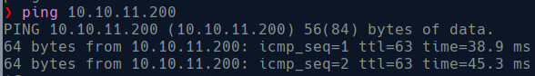

# Interface

We start by checking the connectivity with the machine 

And now we can start scanning open ports

We can see here that the web server is hosted by nginx v1.14.0. Checking the web content we only can se a massage saying that they will be back soon. 

We use curl to get some  information about the site.

We can see here a domain that we add to the /etc/hosts and try to access again, but we get a message “File not found”.

What we can do is try to get if exists other directories within the web server. We use gobuster and seclists to discover it and found:

We have no permissions to access to this directory so we try to fuzz again inside it.

Dompdf is a PHP library that allows you to convert HTML to PDF format. It is an open-source library that is used to generate PDF files dynamically from HTML content. dompdf is useful for generating PDF reports, invoices, or any other printable document from web pages. We  discover an exploit for this library, but we need a directory to post our payload, so we try tu fuzz again but filtering by length instead of status code:

And now we try to fuzz api looking for post directories and get:

With this we can now use the [exploit](https://github.com/positive-security/dompdf-rce). We download both files and modify it to use our ip (I had tones of problems so i had to restart the vpn thats why it change :). The payloads may look like:

Where we modify the src to add the url of our local hosted server and the exploit php. This php is a bynary that correspond with a real font and we add at the end the payload: 

Now with this when we access to this file the server will execute an interactive shell and redirect it to our machine. Now we need to load this files in the server, to do that we capture with burpsuite the request to /api/html2pdf and modify it to post this:

With this the server will request our server the file exploit.css and as exploit.css redirect to esploit_font.php, this file may be stored on the server.

Now this file is stored in the server we need to access it in order to make the server run the code, the problem here is that the file is not stored with the name we use, so we need to calculate the name that the serve use:

And with this name we will request the file:

And we will see that we got a shell as www-data:

