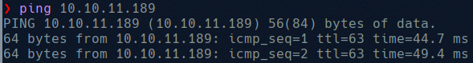

# Precious

# Information gathering

We start by checking the connexion with the machine: 

And once we know we have connexion we can perform a enumeration using nmap:

We see open ports 22(ssh) and 80(http), and see that port 80 have a web server [http://precious.htb](http://precious.htb) so we add this to our /etc/hosts and in firefox go to the web page:

We see that is a conversor from web to pdf, we will check the functionality by passing a web to them. We should host a web server using python:

And use this server in the web page, this will download a pdf.

To see more about the document we can check the metadata by using exiftool:

The interesting part here is the Creator, where we discover that is created by pdfkit v0.8.6 and we can check if exists a exploit for this.

We can see that the library is vulnerable to command injection: “an application could be vulnerable if it tries to render a URL that contains query string parameters with user input” and “if the provided parameter happens to contain a URL encoded character and a shell command substitution string, it will be included in the command that PDFKit executes to render the PDF”.

So now we will try to abuse this vulnerability to get a reverse shell,  in order to do this we will use [revshells.com](http://revshells.com/) and create a payload to add to the URL submitted to the web page:

And with this we will get connexion to the server:

Locking around the home directory we see two users directories:

And in henry directory we find the user.txt flag, but as user ruby we have no permission to read it:

So we look around a little more and found the credentials of user henry:

So we try to login as henry

Now we need to escalate privileges and get root. As user henry execute sudo -l, to see the commands that can be executed as root, and discover   

Now check the code and see that it use YAML.load() that is vulnerable function. 

Now we need to generate a yml payload to be load in the code an let us execute as bash as root:

This yml payload will allow us to get a root bash, so now we need to execute the dependencies update: 

Now /bin/bash have sudoers permission:

And can be executed as root:

