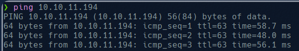

# Soccer

As always we start by checking the connectivity with the machine: 

And now we try to get all open ports:

We can see the domain hosted on port 80, we add this domain to our /etc/hosts and access to the web.

We won’t get nothing from this interface so we will try to get some directories by using gobuster:

So now we try to access /tiny dir:

We can see that this is a Tiny file manager login, an opensource file manager, looking in the github repository of Tiny we can find the default credentials 

So we will try to access using it.

And we get access:

We can see here all the images used in the web and also the html code of the web page, into tiny folder we can find a php file with a user password:

We can se that is possible to upload files, so that is what we going to do, we will create a php payload in order to get a shell in our machine:

Now we upload this file and using netcat we start listening on port 4444:

And access to his file uploaded using curl.

So now we are in as user www-data. We cant get nothing from here.

We go back to the open ports and see that in pot 9091 there is a web socket. The main difference between HTTP and WebSocket is that HTTP is built on a request-response model whereas WebSocket is like a Socket connection where both client and server can send data anytime asynchronously. So you can’t repeat the requests made in WebSocket as you would normally do for HTTP Requests in BurpSuite.

We google it and try to exploit it using sql injection based on [this](https://rayhan0x01.github.io/ctf/2021/04/02/blind-sqli-over-websocket-automation.html) report. We change the ws url of the script

And the data:

And now we run the script and start sqlmap pointing to localhost port 8081:

So the basic idea to solve this is:

1. have an HTTP Server script that will receive the SQLMap payload via GET parameter.
2. format the payload if needed (for example wrap it in a JSON format)
3. create a WebSocket connection to actual target, receive response and extract any token if needed.
4. Send SQLi payload and receive Output from WebSocket.
5. Display the output as response

And now sqlmap will make request to our localhost  http server on port 8081 where the script is running, and the script will forward this request to the web socket and get the response.

Now with this creds we try to connect using ssh:

Now we can see user flag and we try to escalate privileges. We can not use sudo -l, so we use:

And find all executables with suid. We see doas command and we access to its config. 

We can execute dstat as root without password.

The point here is to write a script in the dstat plugins folder that add the suid flag to /bin/bash:

Now we can execute bash as root

