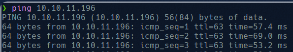

# Stocker

We start checking the connexion with the machine:

Now we perform an open port scan using nmap:

With this we discover the domain stocker.htb so we add it to the etc host and access to the web:

But we don’t find nothing to do with it. We will try to find subdomains:

So now we add the subdomain to the /etc/hosts and access to the subdomain

Try to use different credentials and sql injections but nothing happened so we try to capture using burpsuit to analyse the request.

Trying different things, we get that using [no sql injection](https://book.hacktricks.xyz/pentesting-web/nosql-injection#basic-authentication-bypass) we can bypass it by changing the content type to json:

With this we get access to a new page:

We can add different products to the cart, and we can see the purchase after buy it. When click on the see purchase we are redirect to a site in which we see the name of the product and the price. We can try to modify the purchase to get some info instead of the name of the product.

The original request:

The original response:

The new request

The new response:

So now knowing that we can modify the request in order to get info we can try to get /etc/passwrd:

Now we know some users of the machine, now we have a method to get different info and files stored in the machine we can try to get config files of /var/www/dev:

Here we see a connexion to MongoDB using password: IHeardPassphrasesArePrettySecure so now as SSH is open we will try to connect using angoose user and this password.

Now we try to get root privileges, to do so we need to know what commands are executed as sudo for this user:

This is that we can execute as root all node js which dir start with /usr/local/scripts, so now we create a new file that modify /etc/bash and add the suid permission flag, in order to exec the bash as root:

